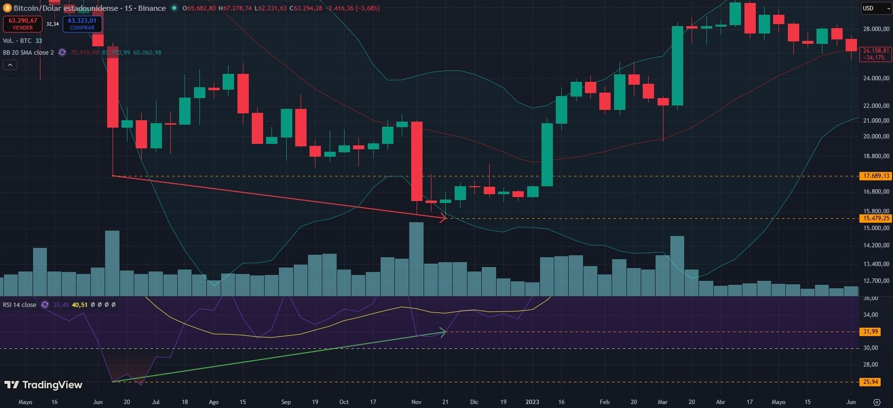
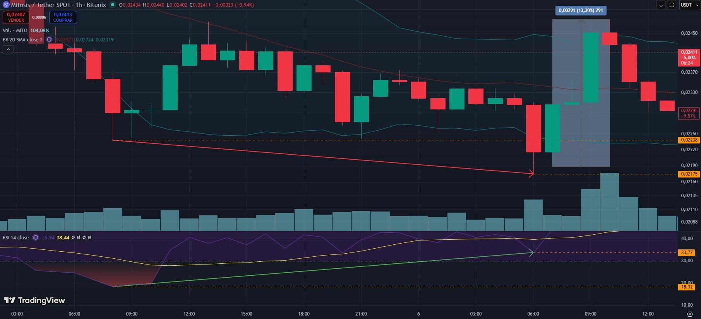

# *Crypto Engine*

Este repositorio contiene una solución ETL, desarrollada en Python/Pandas, para la detección de señales de compra en criptoactivos.

A partir de la API de la plataforma de intercambio de criptomonedas elegida (a día de hoy, hay interfaces disponibles para Bitunix, OKX y Kraken), *Crypto Engine* genera un informe de divergencias alcistas para todos los pares de mercado activos en diferentes marcos temporales (de quinceminutal a diario), que facilita al usuario la toma de decisiones de entrada.

**ADVERTENCIA:**

*Crypto Engine* es una herramienta experimental de análisis técnico. Las señales generadas por el programa se basan en criterios algorítmicos y en ningún caso constituyen recomendaciones de inversión, asesoramiento financiero ni garantías de rentabilidad.

Los mercados de criptomonedas son altamente volátiles y conllevan un riesgo significativo de pérdida total o parcial del capital invertido. Los autores de este proyecto no asumen responsabilidad alguna por los perjuicios derivados del uso de la información proporcionada por la aplicación; en consecuencia, utilice esta herramienta bajo su propia responsabilidad y nunca invierta cantidades cuya pérdida no esté dispuesto a asumir.

## 1. Estructura del repositorio

Los directorios y archivos de principal interés son:

```
crypto-engine/
├── code/
│   ├── exchanges/
│   │   ├── abstract_exchange.py
│   │   ├── bitunix.py
│   │   ├── kraken.py
│   │   └── okx.py
│   ├── aux_functions.py
│   ├── divergence_functions.py
│   └── main_functions.py
├── config/
│   └── config.yml
├── main.py
├── pyproject.toml
└── README.md
```

## 2. Configuración en local

*Crypto Engine* utiliza [UV](https://docs.astral.sh/uv/) para la gestión unificada de dependencias y entornos virtuales. Se puede instalar fácilmente siguiendo estas [instrucciones](https://docs.astral.sh/uv/getting-started/installation/).

La configuración de *Crypto Engine* es muy sencilla e implica únicamente dos pasos:
1. Clonar el repositorio en el directorio de su elección:
    ```
    git clone https://github.com/jblancop/crypto-engine.git
    ```
2. Desde la raíz del repositorio, sincronizar UV:
    ```
    uv sync
    ```
Este comando instala todas las dependencias definidas en `pyproject.toml`. El entorno virtual se creará en cuanto se ejecute `main.py` por primera vez.

## 3. Fundamentos teóricos

Una divergencia alcista es una figura de análisis técnico que se produce cuando el precio de un activo registra un nuevo mínimo mientras que un indicador de momento (en el caso de *Crypto Engine*, el RSI, *Relative Strength Index* o Índice de Fuerza Relativa) no confirma dicho movimiento y forma, por el contrario, un mínimo más alto. Esta discrepancia entre el comportamiento del precio y el indicador puede interpretarse como una señal de agotamiento de la presión vendedora y una posible reversión alcista.

En la imagen, la divergencia alcista en marco semanal que supuso el fin del ciclo bajista de Bitcoin frente al dólar estadounidense en noviembre de 2022:



El precio baja desde los ~17.700 a los ~15.500 dólares mientras el RSI (sin unidades, oscila entre 0 y 100) sube de ~26 a ~32; tras unas semanas de lateralización, el precio arranca al alza e inicia un ciclo alcista de gran magnitud. En octubre de 2025, Bitcoin llegaría a superar los 125.000 dólares.

*Crypto Engine* analiza el mercado en tiempo real y detecta divergencias alcistas en todos los pares activos para marcos temporales de operativa a corto (quinceminutal y horario), medio (cuatro horas) y largo (diario) plazo.

## 4. Funcionamiento

La ejecución de *Crypto Engine* es muy sencilla; desde la raíz del repositorio:
```
uv run main.py --exchange <bitunix|kraken|okx>
```
Este comando desencadena un proceso ETL que extrae información de la API de la plataforma elegida y la transforma en un informe de divergencias, materializado en forma de archivo .txt en `code/output`. 

Cada plataforma está modelada como una implementación de la clase abstracta `Exchange`, que se encuentra en `code/exchanges/abstract_exchange.py`. Esta clase abstracta especifica una serie de métodos que han de ser obligatoriamente desarrollados por cada una de sus implementaciones hijas:
1. `parse_pairs()`: Obtiene un listado de todos los pares de mercado activos.
2. `set_params()`: Especifica los parámetros con que se ha de consultar el punto final `candles` de la API.
3. `parse_candles()`: Para cada par de mercado, obtiene un conjunto de velas en forma de *DataFrame* Pandas.

La consulta al punto final `candles` de la API se realiza de forma concurrente para obtener todos los conjuntos de velas en el mínimo tiempo posible; una vez concluidas las peticiones, comienza la detección en local de divergencias.

A partir de las velas, que incluyen una marca temporal y precios máximos y mínimos y de apertura y cierre, se estima el RSI; con la información del precio y del RSI, es posible calcular las divergencias por comparación de pivotes.

Cada divergencia estimada por pivotes, que puede tener varios tramos sucesivos, se enriquece con información sobre pendientes (si hay divergencia entre precio y RSI no sólo para mínimos locales sino para toda la serie de datos entre ellos) y volumen (para detectar si en los pivotes hubo una actividad inusual de compraventa y si ésta es creciente con el tiempo).

Toda esta información se combina en un índice de fuerza (*Strength*) que proporciona una estimación de la fiabilidad potencial de la señal detectada. A modo de ejemplo, tómese la siguiente divergencia, calculada el día 06/06/2026 en Bitunix para la criptomoneda [Mitosis](https://mitosis.org/) frente a USDT (Tether, una criptomoneda estable cuyo valor es equivalente al del dólar americano):

```
60/MITOUSDT:
{'strength': 6, 'pivot_timestamps': ['2026-06-05 08:00', '2026-06-06 06:00'], 'slope_candles': 60, 'latest_vol_ratio': 2.21, 'rising_vol': True}
```
La fuerza es **+6** debido, en primer lugar, a la existencia de una divergencia por pivotes (cada par de pivotes sucesivos añade **+1** al índice); sin embargo:    
1. Se ha detectado a su vez una divergencia por pendientes durante 60 velas (cada 20 velas sucesivas añaden **+1** al índice), lo que indica que, aunque no haya una coincidencia de mínimos clara, hay una tendencia divergente entre precio y RSI ya anterior a lo que indica la divergencia por pivotes.
2. El volumen de compraventa para el último pivote es al menos 2 veces la media de todos los mínimos precedentes detectados en la serie histórica analizada (se añade otro **+1** al índice).
3. Hay un volumen creciente entre pivotes (se añade otro **+1** al índice).



Como se observa en el gráfico, la divergencia produjo a continuación un aumento del precio de más del 13 %. Hay que tener en cuenta que es una operación en un marco horario y, por tanto, a corto plazo.

**ADVERTENCIA:**

*Crypto Engine* es una herramienta experimental de análisis técnico. Las señales generadas por el programa se basan en criterios algorítmicos y en ningún caso constituyen recomendaciones de inversión, asesoramiento financiero ni garantías de rentabilidad.

Los mercados de criptomonedas son altamente volátiles y conllevan un riesgo significativo de pérdida total o parcial del capital invertido. Los autores de este proyecto no asumen responsabilidad alguna por los perjuicios derivados del uso de la información proporcionada por la aplicación; en consecuencia, utilice esta herramienta bajo su propia responsabilidad y nunca invierta cantidades cuya pérdida no esté dispuesto a asumir.